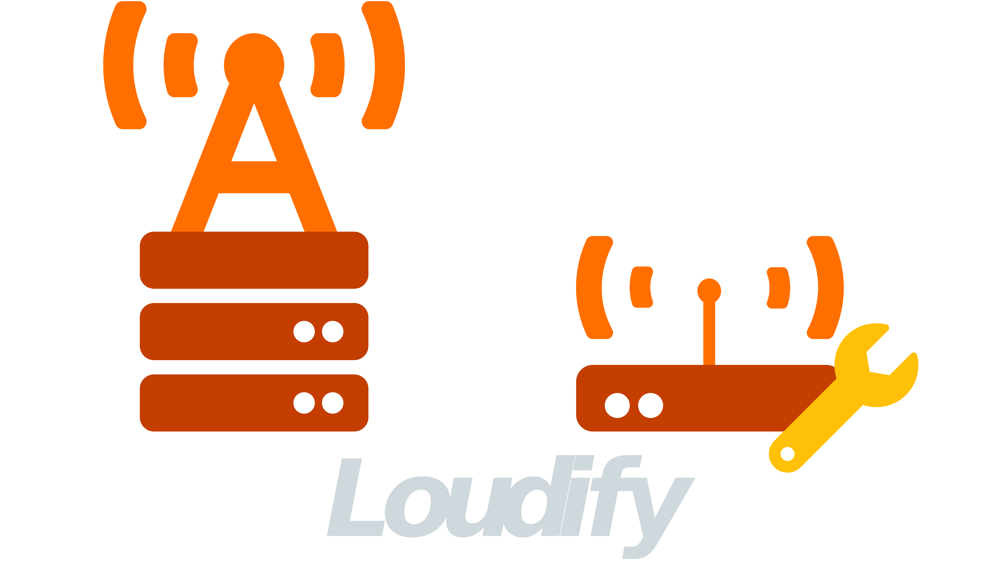

# loudify

> Running a GNU Radio flowgraph in a ZMQ client <-> broker <-> worker setup.

<!-- 
[](https://martynvdijke.github.io/gr-lora_sdr/html/index.html)
 -->
[](https://loudify.readthedocs.io/en/latest/?badge=latest)
[](https://www.codacy.com/gh/martynvdijke/loudify/dashboard?utm_source=github.com&amp;utm_medium=referral&amp;utm_content=martynvdijke/loudify&amp;utm_campaign=Badge_Grade)

[](https://github.com/martynvdijke/loudify/blob/dev/LICENSE)
[](https://github.com/psf/black)
[](https://pepy.tech/project/loudify)
[](https://github.com/martynvdijke/loudify/actions/workflows/dev_docker_build.yml)

<br />
<p align="center">
  <a href="https://github.com/martynvdijke/loudify/settings">
    
  </a>

  <h3 align="center">Loudify: LoRa cloudified</h3>

  <p align="center">
    <br />
    <a href="https://loudify.readthedocs.io/en/latest"><strong>Explore the docs »</strong></a>
    <br />
    <br />
    <a href="https://github.com/martynvdijke/loudify/issues">Report a bug</a>
    <a href="https://github.com/martynvdijke/loudify/issues">Request a feature</a>
  </p>
</p>

# Summary

This project consist of three different parts namely the client that is running a GNU Radio flowgraph, the worker receiving the data and doing the actual demodulation process and the broker connecting the two together.
This repo holds the code for all the parts, be sure to check out [gr-lora_sdr](https://github.com/martynvdijke/gr-lora_sdr) to see how this codes integrates into GNU Radio.

## Docs

Documentation is built automatically on commits, and can be visited by going to [docs](https://loudify.readthedocs.io/en/latest/)

## Why

This project together with the GNU Radio code located in [gr-lora_sdr](https://github.com/martynvdijke/gr-lora_sdr) is part of my graduation project which is called a Centralized Radio Acces Network gateway for LoRa.
Its purpose is to research if it is possible to be able to aggregate LoRa packets originating from different LoRa gateways by making a central point (aka the broker) that all gateways can connect to. The overall high level idea is to let LoRa gateways share information on the reception of their signals.

## Installing

Installing the project can be done in two ways, by installing the normal PyPi release

```sh
pip install loudify
```

Or by installing directly from the repo either by doing pip git install

```sh
pip install git+https://github.com/martynvdijke/loudify.git
```

Or by cloning the repo and running flit install

```sh
pip install flit
git clone https://github.com/martynvdijke/loudify
cd loudify
flit install
```

## Architecture

For a more detailed overview of the entire architecture and to be able to see how everything is connected visit [architecture](docs/architecture.md)

## Contributing

Pull requests are welcome. For major changes, please open an issue first to discuss what you would like to change. Make sure to add or update tests as appropriate.

## [Changelog](docs/changelog.md.md)
