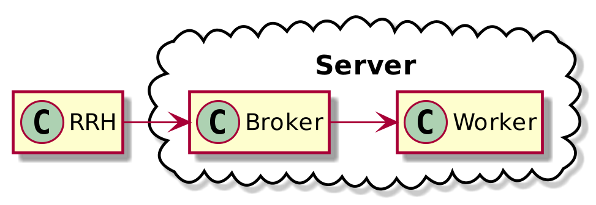
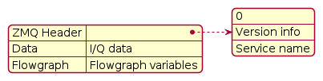
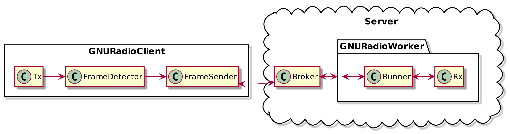

# Architecture

## High Level

On a high level the overview of the system can be given by the picture below, it shows the main components of the system namely the RRH (also called the client) the broker as a central connecting point and the worker.

The network packets that get transmitted are comprised of the following:

- ZMQ header, a ZMQ header that is needed for the routing of the packets.
- Data, the actual I/Q data coming from the client
- Flowgraph vars, the variables for the decoding of the LoRa packet.

On a lower level the architecture is given by the following picture, where the client as the worker are more detailed.

The client consists of

- Tx : Transmitting block that's transmitting LoRa symbols
- FrameDetector : A detector for where the frame starts and ends
- FrameSender : Frame sender a ZMQ client that finds the LoRa packet and packages it up for transmission to the Broker.

On a more detailed level the worker can be described by:

- Runner : A python file that runs a GNU Radio flowgraph in a separate process and takes the I/Q data forwards that to the flowgraph and takes the flowgraphvars for the initialization of the flowgrpah.
- Rx : The actual GNU Radio flowgraph that does the demodulation.