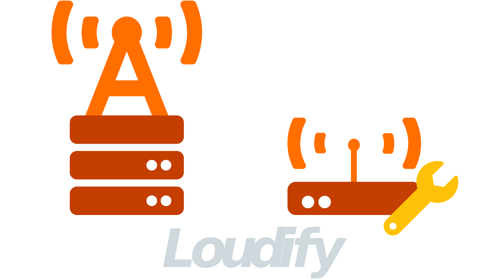

# Welcome to Loudify docs

[](https://loudify.readthedocs.io/en/latest/?badge=latest)
[](https://www.codacy.com/gh/martynvdijke/loudify/dashboard?utm_source=github.com&amp;utm_medium=referral&amp;utm_content=martynvdijke/loudify&amp;utm_campaign=Badge_Grade)

[](https://github.com/martynvdijke/loudify/blob/dev/LICENSE)
[](https://github.com/psf/black)
[](https://pepy.tech/project/loudify)

<!-- PROJECT LOGO -->
<br />
<p align="center">
  <a href="https://github.com/martynvdijke/loudify">
    
  </a>

  <h3 align="center">LoRa cloudified</h3>
</p>

## Summary

Welcome to the loudify docs, Loudify (LoRa cloudified) is a Python project to be able to run a GNU Radio flowgraph as a ZMQ client <-> broker <-> worker context.
The project consists of three distinct parts mainly:

- [Client](client.md)
- [Broker](broker.md)
- [Worker](worker.md)
  
In short the purpose of the client is to transfer a network frame trough ZMQ to the broker, the broker is the central controlling point of the entire system and makes it possible for dynamic discovery of both clients and workers. The broker forwards the received network packet by the client to one of the workers that are connected to the broker (by use of TCP) receives the network packet, operates on the network packet and sends back an ACK to the original client requesting the network packet.

To be able to control and query the broker there is also a cli interface for getting system level information which can be found by going to [cli](cli.md).

### Why?

This project together with the GNU Radio code located in [gr-lora_sdr](https://github.com/martynvdijke/gr-lora_sdr) is part of an experimental graduation project at the university of Eindhoven which is called a Centralized Radio Acces Network gateway for LoRa.
The purpose is to research if it is possible to be able to aggregate LoRa packets originating from different LoRa gateways by making a central point (aka the broker) that all gateways can connect to. The overall high level idea is to let LoRa gateways share signal information dynamic and real time by using a central routing point.

## Installing

Installing the project can be done in two ways, by installing the normal PyPi release

```sh
pip install loudify
```

Or by installing directly from the repo either by doing pip git install

```sh
pip install git+https://github.com/martynvdijke/loudify.git
```

Or by cloning the repo and running flit install

```sh
pip install flit
git clone https://github.com/martynvdijke/loudify
cd loudify
flit install
```


## [Changelog](changelog.md)