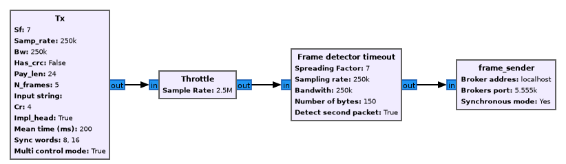

# Usage

To use loudify we consider you have access to three computers, lets call them A for client (the computer transmitting the network packets), b the network Broker and C the worker computer.
To start you will need loudify installed on all three computers.

## Broker

The broker can be star by using th provided cli interface on a specific port. By default, the broker uses TCP port 5555 for communication. Be sure to have this port enabled and forwarded in your router if you are behind NAT.

```
loudify-broker -p 5555
```

## Client

While you can start the client as in the cli, its is best to start it using a GNU Radio,
an example flowgraph is given below.



Where in the `frame_sender` block in the flowgraph the information of the broker ip/dns address, port and modus needs to be filled in. The address and the port are needed for connecting to the broker. The modus specifies the synchronous or asynchronous mode the client uses for its communication.

## Worker

While a worker can also be executed in the cli, it's best to embed the frame sender as part of a GNU Radio flowgraph. Be careful for now in order to be able to close the flowgraph you have to manually edit the ```tb.stop()``` in the generated flowgraph, this is a temporary workaround.
Once the flowgraph with the ```frame_reciever``` block init has started the worker will register itself at the broker ready for network packets to be processed.

## CLI

TODO: